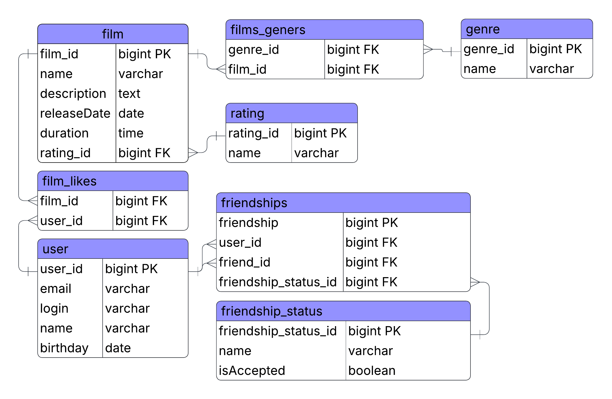

# Описание ER-диаграммы для java-filmorate

### Сама диаграмма:

## Таблицы
- film - хранит данные о фильмах
- user - хранит данные о пользователях
- genre - хранит данные о жанрах фильмов
- rating - хранит данные возрастных рейтингов фильмов
- friendship_status - хранит данные о статусе дружбы
- friendships - хранит данные о дружбе пользователей
- film_likes - хранит внешние ключи таблиц user и film для определения пользователей, которым фильм понравился
- films_geners - хранит внешние ключи таблиц genre и film для определения у фильма нескольких жанров

## Описание таблиц
1. Таблица пользователей
   ```SQL
   CREATE TABLE user (
    user_id BIGINT PRIMARY KEY,
    email VARCHAR(255) NOT NULL UNIQUE,
    login VARCHAR(255) NOT NULL UNIQUE,
    name VARCHAR(255) NOT NULL,
    birthday DATE
   );
   ```
2. Таблица рейтингов фильмов
   ```SQL
   CREATE TABLE rating (
    rating_id BIGINT PRIMARY KEY,
    name VARCHAR(50) NOT NULL
   );
   ```
3. Таблица фильмов
   ```SQL
   CREATE TABLE film (
    film_id BIGINT PRIMARY KEY,
    name VARCHAR(255) NOT NULL,
    description TEXT,
    releaseDate DATE,
    duration TIMESTAMP,
    rating_id BIGINT,
    CONSTRAINT fk_film_rating
        FOREIGN KEY (rating_id) REFERENCES rating(rating_id)
   );
   ```
4. Таблица жанров
   ```SQL
   CREATE TABLE genre (
    genre_id BIGINT PRIMARY KEY,
    name VARCHAR(255) NOT NULL
   );
   ```
5. Связь фильмов и жанров (many-to-many)
   ```SQL
   CREATE TABLE films_geners (
    film_id BIGINT,
    genre_id BIGINT,
    CONSTRAINT fk_fg_film
        FOREIGN KEY (film_id) REFERENCES film(film_id),
    CONSTRAINT fk_fg_genre
        FOREIGN KEY (genre_id) REFERENCES genre(genre_id),
    PRIMARY KEY (film_id, genre_id)
   );
   ```
6. Лайки фильмов (many-to-many)
   ```SQL
   CREATE TABLE film_likes (
    film_id BIGINT,
    user_id BIGINT,
    CONSTRAINT fk_like_film
        FOREIGN KEY (film_id) REFERENCES film(film_id),
    CONSTRAINT fk_like_user
        FOREIGN KEY (user_id) REFERENCES user(user_id),
    PRIMARY KEY (film_id, user_id)
   );
   ```
7. Статусы дружбы
   ```SQL
   CREATE TABLE friendship_status (
    friendship_status_id BIGINT PRIMARY KEY,
    name VARCHAR(255) NOT NULL,
    isAccepted BOOLEAN NOT NULL
   );
   ```
8. Таблица дружбы (many-to-many с атрибутом статуса)
   ```SQL
   CREATE TABLE friendships (
    friendship_id BIGINT PRIMARY KEY,
    user_id BIGINT,
    friend_id BIGINT,
    friendship_status_id BIGINT,
    CONSTRAINT fk_friend_user
        FOREIGN KEY (user_id) REFERENCES user(user_id),
    CONSTRAINT fk_friend_friend
        FOREIGN KEY (friend_id) REFERENCES user(user_id),
    CONSTRAINT fk_friend_status
        FOREIGN KEY (friendship_status_id) REFERENCES friendship_status(friendship_status_id)
   );
   ```
## Примеры запросов
### 🎬 Раздел “Фильмы”
1. Все фильмы с рейтингом
    ```SQL
    SELECT f.name AS film_name,
           r.name AS rating_name,
           f.releaseDate,
           f.duration
    FROM film AS f
    JOIN rating AS r ON f.rating_id = r.rating_id;
    ```
2. Фильмы и их жанры
   ```SQL
   SELECT f.name AS film_name,
          g.name AS genre_name
   FROM film AS f
   JOIN films_geners AS fg ON f.film_id = fg.film_id
   JOIN genre AS g ON fg.genre_id = g.genre_id
   ORDER BY f.name;
   ```

3. Количество жанров у каждого фильма
   ```SQL
   SELECT f.name AS film_name,
   COUNT(fg.genre_id) AS genre_count
   FROM film AS f
   JOIN films_geners AS fg ON f.film_id = fg.film_id
   GROUP BY f.film_id, f.name
   ORDER BY genre_count DESC;
   ```

4. Топ фильмов по лайкам
   ```SQL
   SELECT f.name AS film_name,
   COUNT(fl.user_id) AS likes_count
   FROM film AS f
   JOIN film_likes AS fl ON f.film_id = fl.film_id
   GROUP BY f.film_id, f.name
   ORDER BY likes_count DESC
   LIMIT 10;
   ```

### 👤 Раздел “Пользователи”
5. Список друзей пользователя
   ```SQL
   SELECT u2.name AS friend_name,
          fs.name AS status,
          fs.isAccepted
   FROM friendships AS f
   JOIN user AS u1 ON f.user_id = u1.user_id
   JOIN user AS u2 ON f.friend_id = u2.user_id
   JOIN friendship_status AS fs ON f.friendship_status_id = fs.friendship_status_id
   WHERE u1.login = 'boss';
   ```

6. Количество друзей у каждого пользователя
   ```SQL
   SELECT u.name,
   COUNT(f.friend_id) AS total_friends
   FROM user AS u
   JOIN friendships AS f ON u.user_id = f.user_id
   JOIN friendship_status AS fs ON f.friendship_status_id = fs.friendship_status_id
   WHERE fs.isAccepted = TRUE
   GROUP BY u.user_id, u.name
   ORDER BY total_friends DESC;
   ```

7. Кто лайкнул больше всего фильмов
   ```SQL
   SELECT u.name,
   COUNT(fl.film_id) AS total_likes
   FROM user AS u
   JOIN film_likes AS fl ON u.user_id = fl.user_id
   GROUP BY u.user_id, u.name
   ORDER BY total_likes DESC
   LIMIT 10;
   ```